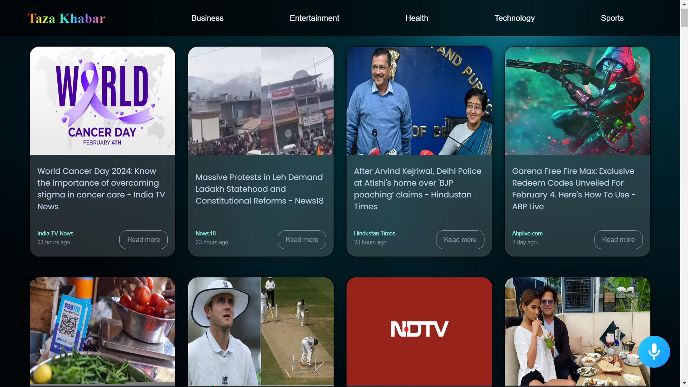
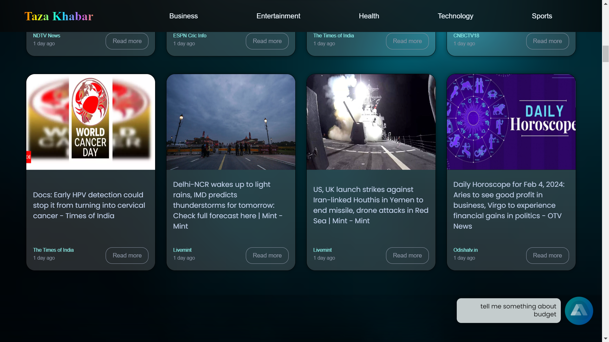

# Voice Controlled News website

My innovative voice-controlled news website, tailored for India. Experience the future of news consumption with seamless voice commands. 
Stay informed effortlessly as our platform delivers curated content across diverse categories with clean UI, all accessible through the power of your voice.


## Documentation

### Node.js and npm:

Ensure you have Node.js and npm installed on your machine. You can download and install them from [Node.js website](https://nodejs.org/en).

### Clone the Repository:
#### Clone this React project repository from GitHub using the following command:
```
git clone https://github.com/Utsavladia/News-Website.git

```
#### Navigate to the folder:
```
cd News-Website
```
#### Install dependencies:
```
npm install
```
#### In your src folder create a file named 
```
config.js
```
#### in config.js add the code:
```
export const newapikey = "Your_news_api_key";
export const alanapikey =
  "4e0e6c32e4834da58a2f29062e59483a2e956eca572e1d8b807a3e2338fdd0dc/stage";

```
Replace the "Your_news_api_key" with your own new api key that you can get from [News Api Website](https://newsapi.org/)

#### Start the development server:
```
npm Start
```


## Demo
#### Mian Page



#### Category Page


#### command for specific Topic...



## Features

- News content across multiple categories.
- Use voice commands for specific topics, categories, and headlines.

- Listening to the latest headlines read by AI read
- Stay informed with the latest updates and headlines from India.

- Clean UI for better experience accross multiple platforms

## Usage


#### To acces the Voice Command Just say
- Hey Alan
- Tell me something about "your topic"
- Tell me latest new about "your topic"
- What's going on with "you topic"

#### To listen to the headlines
- Say "Yes" when it asks - "Do you want me to read the headlines??"


## Tech Stack

- React.js
- Node.js
- Tailwind CSS
- [News API](https://newsapi.org/) - For fetching and displaying news content.

- Alan AI - for customized command handling and featching news accordingly


## Contributing

Contributions are always welcome! 😊😊✨


## Contact

If you have any suggestions or query

Feel free to Contact me at

utsavladia@gmail.com

https://www.linkedin.com/in/utsav-ladia


